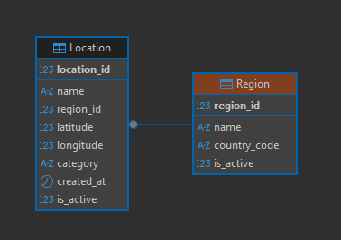

# 📊 GIS Database Setup Guide

This guide will help you set up a local SQL Server database for testing purposes with the GIS Demo application.

## 📋 Table of Contents

- [Overview](#overview)
- [Database Structure](#database-structure)
- [Installation Steps](#installation-steps)
- [Creating the Database Schema](#creating-the-database-schema)
- [Inserting Test Data](#inserting-test-data)
- [Creating QA User](#creating-qa-user)
- [Useful Validation Queries](#useful-validation-queries)
- [Cypress Integration](#cypress-integration)

---

## 🎯 Overview

### What We're Building

You will have:

- **1 Database**: `GisDemo`
- **2 Tables**:
  - `Region` – Geographic regions/areas on the map
  - `Location` – Points on the map (cities, stores, points of interest)

### Business Rules

- Every `Location` belongs to a `Region`
- `name`, `latitude`, and `longitude` are required fields
- `category` must be one of: `CITY`, `STORE`, `WAREHOUSE`, `POINT_OF_INTEREST`

### Test Scenarios

This database allows you to validate:
- Invalid coordinates detection
- Duplicate records identification
- Data persistence after system operations
- Constraint violations
- Foreign key relationships

---

## 🗄️ Database Structure

```
GisDemo
├── Region
│   ├── region_id (PK, auto-increment)
│   ├── name
│   ├── country_code
│   └── is_active
└── Location
    ├── location_id (PK, auto-increment)
    ├── name
    ├── region_id (FK → Region)
    ├── latitude
    ├── longitude
    ├── category (CITY, STORE, WAREHOUSE, POINT_OF_INTEREST)
    ├── created_at
    └── is_active
```



---

## 🚀 Installation Steps

### Step 1: Install SQL Server Express

1. Visit [Microsoft SQL Server Express Download Page](https://www.microsoft.com/en-us/sql-server/sql-server-downloads)
2. Download the **Express** edition (free)
3. Run the installer:
   - Choose **Basic** for quick setup, or **Custom** for advanced options
   - The installer will create a local instance, typically: `localhost\SQLEXPRESS`
4. Take note of:
   - Server name (e.g., `localhost\SQLEXPRESS`)
   - Authentication method:
     - **Windows Authentication** (uses your Windows login)
     - **SQL Server Authentication** (username: `sa` + password you set)

### Step 2: Install DBeaver (Optional)

You can use any SQL client (SSMS, Azure Data Studio, DBeaver, etc.)

#### Installing DBeaver:

1. Download [DBeaver Community Edition](https://dbeaver.io/download/) (free)
2. Install normally

#### Connecting to SQL Server:

1. Open DBeaver
2. Click **Database** → **New Database Connection**
3. Select **SQL Server**
4. Fill in the connection details:
   - **Host**: `localhost`
   - **Port**: `1433` (default)
   - **Database**: (leave empty for now)
   - **Authentication**:
     - **Windows Authentication**: Select if available
     - **SQL Server Authentication**:
       - User: `sa`
       - Password: your password
5. Click **Test Connection**
6. If successful, click **Finish**

You're now connected and ready to execute SQL commands!

---

## 📝 Creating the Database Schema

Execute the following SQL script to create the database and tables:

```sql
-- 1) Create the database
CREATE DATABASE GisDemo;

-- 2) Switch to the new database
USE GisDemo;

-- 3) Create the Region table
CREATE TABLE Region (
    region_id   INT IDENTITY(1,1) PRIMARY KEY, -- Primary key, auto-increment
    name        VARCHAR(100) NOT NULL,          -- Region name
    country_code CHAR(2) NOT NULL,              -- Country code (e.g., BR, US)
    is_active   BIT NOT NULL DEFAULT 1          -- Active status (1=active, 0=inactive)
);

-- 4) Create the Location table
CREATE TABLE Location (
    location_id INT IDENTITY(1,1) PRIMARY KEY,  -- Primary key, auto-increment
    name        VARCHAR(150) NOT NULL,          -- Point name (city, store, etc.)
    region_id   INT NOT NULL,                   -- Foreign key to Region
    latitude    DECIMAL(9,6) NOT NULL,          -- Latitude (-90 to 90)
    longitude   DECIMAL(9,6) NOT NULL,          -- Longitude (-180 to 180)
    category    VARCHAR(30) NOT NULL,           -- Type: CITY, STORE, WAREHOUSE, POINT_OF_INTEREST
    created_at  DATETIME2 NOT NULL DEFAULT SYSUTCDATETIME(), -- UTC timestamp of creation
    is_active   BIT NOT NULL DEFAULT 1,         -- Active status

    -- Foreign key constraint
    CONSTRAINT FK_Location_Region
        FOREIGN KEY (region_id) REFERENCES Region(region_id),

    -- Check constraint for category
    CONSTRAINT CHK_Location_Category
        CHECK (category IN ('CITY','STORE','WAREHOUSE','POINT_OF_INTEREST'))
);
```

### Understanding the Schema

**Region Table:**
- `region_id`: Auto-incrementing integer, primary key
- `country_code`: 2-character fixed field (e.g., BR, US)
- `is_active`: Boolean type in SQL Server (0 = false, 1 = true)

**Location Table:**
- `region_id`: Foreign key linking to Region table
- `latitude`: Decimal with 9 total digits, 6 after decimal point (e.g., -23.567890)
- `longitude`: Decimal with 9 total digits, 6 after decimal point
- `category`: Must be one of the predefined values (enforced by CHECK constraint)
- `created_at`: Automatically stores UTC date/time when record is created

**Viewing Table Structure:**

```sql
-- View Region table structure
EXEC sp_help 'Region';

-- View Location table structure
EXEC sp_help 'Location';
```

---

## 📥 Inserting Test Data

### Insert Regions

```sql
USE GisDemo;

INSERT INTO Region (name, country_code)
VALUES 
    ('São Paulo Metro Area', 'BR'),
    ('Rio de Janeiro Metro Area', 'BR'),
    ('New York State', 'US');

-- Verify insertion
SELECT * FROM Region;
```

### Insert Locations (Including Test Cases)

```sql
-- Insert various locations, including some with intentional issues for testing

INSERT INTO Location (name, region_id, latitude, longitude, category, is_active)
VALUES
    -- Valid: São Paulo
    ('São Paulo Downtown', 1, -23.550520, -46.633308, 'CITY', 1),

    -- Valid: Store in SP
    ('Store Paulista Ave', 1, -23.565000, -46.651000, 'STORE', 1),

    -- Valid: Rio de Janeiro
    ('Rio de Janeiro Downtown', 2, -22.906847, -43.172897, 'CITY', 1),

    -- Valid: Warehouse in NY
    ('NY Warehouse', 3, 40.712776, -74.005974, 'WAREHOUSE', 1),

    -- Test case: Invalid latitude (outside -90 to 90 range)
    ('Invalid Latitude Point', 1, -123.000000, -46.700000, 'POINT_OF_INTEREST', 1),

    -- Test case: Invalid longitude (outside -180 to 180 range)
    ('Invalid Longitude Point', 1, -23.000000, -246.700000, 'POINT_OF_INTEREST', 1),

    -- Test case: Duplicate record (same name and coordinates)
    ('Store Paulista Ave', 1, -23.565000, -46.651000, 'STORE', 1);

    -- Test case: Invalid category (will fail due to CHECK constraint)
    -- ('Weird Category', 1, -23.500000, -46.600000, 'PARK', 1);

-- Verify insertion
SELECT * FROM Location;
```

**Note:** The last commented line will fail if executed because `PARK` is not a valid category. This demonstrates the CHECK constraint in action.

---

## 👤 Creating QA User

Create a dedicated user for automated testing:

```sql
-- 1) Create server login (execute in master database)
USE master;

CREATE LOGIN qa_user
WITH PASSWORD = 'QaTeste@123',
     CHECK_POLICY = OFF;

-- 2) Create user in GisDemo database and grant permissions
USE GisDemo;

CREATE USER qa_user FOR LOGIN qa_user;

-- Grant read permissions
ALTER ROLE db_datareader ADD MEMBER qa_user;

-- Grant write permissions (insert, update, delete)
ALTER ROLE db_datawriter ADD MEMBER qa_user;
```

### Verify User Creation

```sql
-- Check if login was created
SELECT name, type_desc
FROM sys.server_principals
WHERE name = 'qa_user';

-- Check user roles in GisDemo
USE GisDemo;

SELECT 
    u.name AS user_name,
    r.name AS role_name
FROM sys.database_role_members drm
JOIN sys.database_principals r 
    ON drm.role_principal_id = r.principal_id
JOIN sys.database_principals u 
    ON drm.member_principal_id = u.principal_id
WHERE u.name = 'qa_user';
```

### Enable Mixed Mode Authentication (if needed)

```sql
-- Check if Windows-only authentication is enabled
SELECT SERVERPROPERTY('IsIntegratedSecurityOnly') AS IsWindowsAuthOnly;
-- Returns 1 = Windows Authentication only, 0 = Mixed Mode

-- Enable Mixed Mode (SQL Server + Windows Authentication)
EXEC xp_instance_regwrite
  N'HKEY_LOCAL_MACHINE',
  N'Software\Microsoft\MSSQLServer\MSSQLServer',
  N'LoginMode',
  REG_DWORD,
  2; -- 2 = Mixed Mode

-- Enable and reset the qa_user login (if needed)
USE master;
ALTER LOGIN qa_user ENABLE;
ALTER LOGIN qa_user WITH PASSWORD = 'QaTeste@123';
```

**Important:** After enabling Mixed Mode, you must **restart SQL Server** for changes to take effect.

---

## 🔍 Useful Validation Queries

### 1. Find Invalid Coordinates

**Business Rule:** Latitude must be between -90 and 90; Longitude must be between -180 and 180.

```sql
USE GisDemo;

SELECT *
FROM Location
WHERE latitude < -90 OR latitude > 90
   OR longitude < -180 OR longitude > 180;
```

**Purpose:** Detect geographic coordinates that are outside valid ranges, which could cause mapping errors.

---

### 2. Find Records with Missing Required Fields

```sql
SELECT *
FROM Location
WHERE name IS NULL
   OR latitude IS NULL
   OR longitude IS NULL;
```

**Purpose:** Ensure critical fields are not coming empty from the system or integration.

---

### 3. Find Duplicate Records

```sql
SELECT 
    name,
    latitude,
    longitude,
    COUNT(*) AS total
FROM Location
GROUP BY 
    name,
    latitude,
    longitude
HAVING COUNT(*) > 1;
```

**Purpose:** Identify duplicate map points with the same name and coordinates, which may cause confusion in the UI or reports.

---

### 4. Count Active Locations Per Region and Category

```sql
SELECT 
    r.name AS region_name,
    l.category,
    COUNT(*) AS total_locations
FROM Location l
JOIN Region r ON r.region_id = l.region_id
WHERE l.is_active = 1
GROUP BY 
    r.name,
    l.category
ORDER BY 
    r.name,
    l.category;
```

**Purpose:** Get an overview of location distribution across regions and categories for reporting and dashboards.

---

### 5. Validate Recently Created Record

```sql
SELECT TOP 1 *
FROM Location
WHERE name = 'Test Store'
ORDER BY created_at DESC;
```

**Purpose:** After running a manual or automated test, verify if the data was correctly persisted in the database.

---

## 🔗 Cypress Integration

### Database Configuration

The database connection is already configured in `cypress.config.js` using environment variables:

```javascript
const dbConfig = {
  user: process.env.DB_USER,
  password: process.env.DB_PASSWORD,
  server: process.env.DB_SERVER,
  port: Number(process.env.DB_PORT) || 1433,
  database: process.env.DB_DATABASE || 'GisDemo',
  options: {
    encrypt: false,
    trustServerCertificate: true
  }
};
```

### Environment Variables Setup

Create a `.env` file in the project root with your database credentials:

```env
DB_USER=qa_user
DB_PASSWORD=QaTeste@123
DB_SERVER=localhost\SQLEXPRESS
DB_PORT=1433
DB_DATABASE=GisDemo
```

### Running Database Tests

**Important Notes:**

- ⚠️ **Database tests can only be executed locally** against your local SQL Server instance
- 🔒 The `.env` file should **never** be committed to version control (already in `.gitignore`)
- 🚀 **Future Enhancement**: The database and API will be deployed to a test environment for CI/CD integration

### Test Files

Database validation tests are located in:
- `cypress/e2e/db/db-validation.cy.js`

### Example Test Execution

```bash
# Open Cypress Test Runner
npx cypress open

# Run database tests in headless mode
npx cypress run --spec "cypress/e2e/db/**/*.cy.js"
```

---

## 🎯 Next Steps

1. ✅ Install SQL Server Express locally
2. ✅ Create the `GisDemo` database and schema
3. ✅ Insert test data
4. ✅ Create the `qa_user` for automated tests
5. ✅ Configure `.env` file with database credentials
6. ✅ Run database validation tests with Cypress

## 🔮 Future Improvements

- Deploy database and API to a dedicated test environment
- Integrate database tests into CI/CD pipeline
- Add database seeding scripts for different test scenarios
- Implement database cleanup strategies
- Add visual regression tests for map components

---

## 📚 Additional Resources

- [SQL Server Express Documentation](https://docs.microsoft.com/en-us/sql/sql-server/)
- [DBeaver Documentation](https://dbeaver.io/docs/)
- [Cypress Custom Tasks](https://docs.cypress.io/api/commands/task)
- [mssql npm package](https://www.npmjs.com/package/mssql)

---

**Happy Testing! 🎉**
